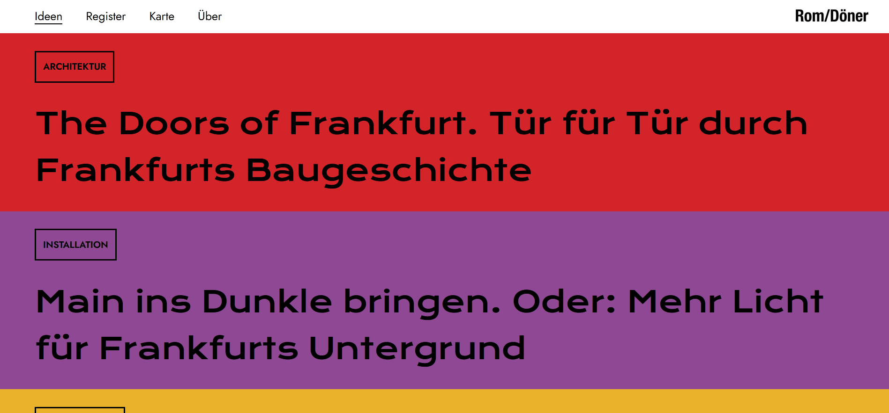
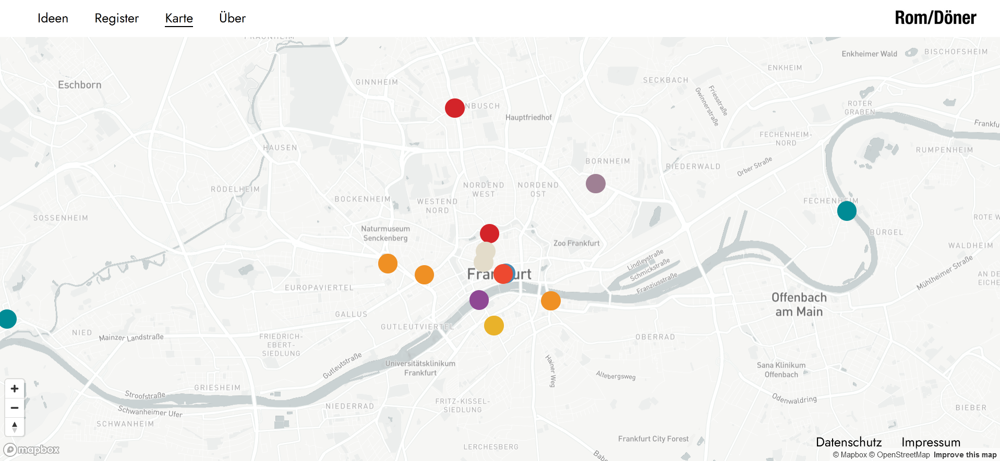
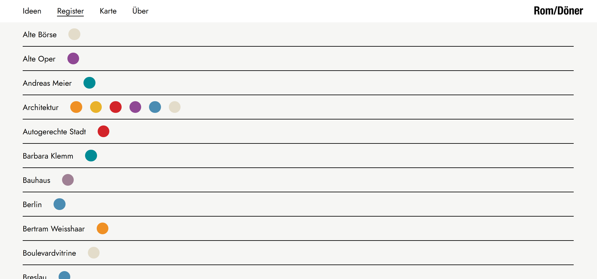

# Rom/Döner

[Rom/Döner - Ideen für Frankfurt](https://www.romdoener.de/)\
Built with *React*.

## Setup

Clone this repository.\
Install the required npm-packages and start the client:

```shell
$ npm install
$ npm start
```

Open [http://localhost:3000](http://localhost:3000) to visit *Rom/Döner*.




